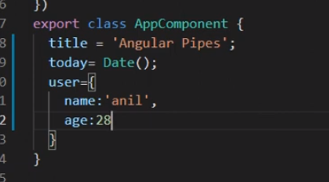

## ANGULAR

`npm i -g @angular/cli`

`ng version`

`ng new blog`

### Intro

File structure:

- src -> app -> component(reusable piece of code):
  - .component.css
  - .component.html
  - .component.ts -> for all the typescript logic
  - .component.spec.ts
  - .module.ts
- src -> assets -> images
- src -> environments -> .prod.ts, .ts -> to setup environment
- index.html -> first file that loads
- main.ts -> bootstraps angular to .html
- style.css -> global css
- angular.json -> configuration file for our angular project
- tsconfig.json -> global typescript configurations
- tsconfig.app.json -> application typescript configurations
- tsconfig.spec.json -> typescript configurations for spec file

.html files are called template files and .ts files are called class files

### app.component.ts

```
@Component({
  selector: 'app-root',
  standalone: true,
  imports: [RouterOutlet],
  templateUrl: './app.component.html',
  styleUrl: './app.component.css',
})
export class AppComponent {             //these are the variables that one can access in the app.component.html
  title = '17';
}
```

app.component.html:

```
<h1>Hello Angular {{ title }}</h1>

```

### Interpolation

HTML page ke upar dynamic data ko display krne ke liye like the above example

data defined in the .component.ts is the dynamic data which can come from api, logic or any other place and to show it in .component.html is called interpolation

the dynamic data can also be a function as:

```
export class AppComponent {
  title = '17';
  data = 'Code Step by Step';
  getValue() {
    return 'This function gets data';
  }
}
```

```
<h2>{{ getValue() }}</h2>
```

It is kind of like running js in react component and similar to it, we cannot manipulate the data

### Angular CLI commands

- ng generate -> component, module, class
  - ng generate component login or
  - ng g c login

by default the component is created in /app

module is kind of a broader clubbing of related components

### Component

To render a component inside another component, find the selector of that component which is present in the .component.ts file when declaring the component, and use it as a html tag wherever you want to use it. Also, add it to the imports array of the component you are using it in.

### Inline style and inline template

`ng generate component user-list-inline --inline-style`

When there is minimal requirements for styling or most of the styling is from style.css (the global one)

generates the component without the .component.css file, and the classes of .component.html can be targeted in .component.ts file in styles

`ng generate component user-list-template --inline-template`

generates component without the .component.css file, the html can be targeted in .component.ts file in template

`ng g c user-list-inline-style-template --inline-style --inline-template`

combines the use case of both and does not create neither the css file nor the html file

### Module

A complete feature/functionality on it's own like : auth that contains login, signup or forgot password

A component can be reusable but not a module

it manages : components that need to be exported, modules that need to be imported, components that are declared under that module,

it also kind of works as lazy-loading

### Make and call function

```
export class AppComponent {
  title = '17';
  data = 'Code Step by Step';
  getValue(name: string) {
    window.alert(name);
  }
}

```

Calling a function on button click:

```
<button (click)="getValue('Code step by step')">Click Me</button>
```

### Events (blur, keyup, keydown, mouseover, mouseleave)

<input
type="text"
#box
(keyup)="getValue(box.value)"
placeholder="event keyup"
/>

The #box is the id whose value can be accessed throughout the html

#### Getting text box value and printing it

```
<input type="text" #name placeholder="Enter name" name="userName" />

<button (click)="getValue(name.value)">Click</button>

<p>Input value: {{ displayName }}</p>
<p>Placeholder: {{ name.placeholder }}</p>
<p>Name: {{ name.name }}</p>
```

```
export class AppComponent {
  title: string = 'Get Input Box Value';
  displayName: string = '';
  getValue(name: string) {
    this.displayName = name;
  }
}
```

#### Counter Button example

```
<h2>{{ title }}</h2>

<p>Counter Value: {{ count }}</p>

<button (click)="increment()">Increment</button>
<button (click)="decrement()">Decrement</button>
<button (click)="reset()">Reset</button>
```

```
export class AppComponent {
  title: string = 'Counter';
  count: number = 0;
  increment() {
    this.count++;
  }
  decrement() {
    this.count--;
  }
  reset() {
    this.count = 0;
  }
}
```

### Stying

#### Internal Styling

```
<style>
  .green {
    color: magenta;
  }
</style>

<button (click)="increment()" class="green">Increment</button>
```

The global styling has lesser priority as the dedicated .component.css file which has lesser priority as internal styling

### Property Binding

For changing property or attribute we use property binding

boolean values are not assignable through interpolation

```
<input
  type="text"
  name="user-name"
  disabled="{{ disabled }}"
  value="{{ name }}"
/>
<input type="text" name="user-name" [disabled]="disabled" [value]="name" />
```

```
export class AppComponent {
  name: string = 'Random';
  disabled: boolean = false;
}
```

interpolation converts value to string or numeric values, hence disabled is converted to string which results in true

Boolean values cannot be assigned through interpolation because interpolation ({{ ... }}) in Angular is designed for rendering string values in the HTML template. It converts the expression inside the curly braces into a string and inserts it into the DOM. Boolean values, on the other hand, are meant to be used directly in Angular templates or bindings without conversion to strings.

### If-Else Condition

> To use it, we need to import commonModule first

```
<h1 *ngIf="showName">{{ show }}</h1>
<h1 *ngIf="!showName">{{ dont }}</h1>

<button (click)="toggleShow()">Toggle</button>
```

```
...
import { CommonModule } from '@angular/common';
@Component({
  selector: 'app-root',
  standalone: true,
  imports: [
    ...,
    UserListTemplateComponent,
    CommonModule,
  ],
  templateUrl: './app.component.html',
  styleUrl: './app.component.css',
})
export class AppComponent {
  show: string = 'Now you see me';
  dont: string = "Now you don't";
  showName: boolean = true;
  toggleShow() {
    this.showName = !this.showName;
  }
}
```

OR

```
<h1 *ngIf="show; then ifblock else elseblock"></h1>
<ng-template #ifblock>
  <h1>Now you see me</h1>
</ng-template>
<ng-template #elseblock>
  <h1>Now you don't</h1>
</ng-template>
```

### Else-If Condition

```
<ng-template [ngIf]="showName"></ng-template>
```

### Switch Case

```
<div [ngSwitch]="color">
  <h1 style="color: red" *ngSwitchCase="'red'">Red Color</h1>
  <h1 style="color: green" *ngSwitchCase="'green'">Green Color</h1>
  <h1 style="color: blue" *ngSwitchCase="'blue'">Blue Color</h1>
  <h1 *ngSwitchDefault>Unknown Color</h1>
</div>
```

### Loop - \*ngFor

```
<h1>{{ title }}</h1>

<h3 *ngFor="let item of users">UserName: {{ item }}</h3>
```

```
export class AppComponent {
  title: string = 'For loop';
  users: string[] = ['Alpha', 'Beta', 'Gamma', 'Zeta'];
}
```

> for styling, a div that has inline style property, for [style.color]="green", green is like a variable that is passed down from .component.ts, to apply inline css, we also use single quotes along with double quotes as [style.color] = "'green'"

### Forms - ngForm

Two types : template based, reactive

```
<h1>
  {{ title }}
</h1>

<form #basicForm="ngForm" (ngSubmit)="getData(basicForm.value)">
  <input type="text" ngModel name="user" placeholder="Enter user name" />
  <br />
  <input type="text" ngModel name="email" placeholder="Enter user email" />
  <br />
  <input
    type="text"
    ngModel
    name="password"
    placeholder="Enter user password"
  />
  <br />
  <button>Register</button>
</form>

<ul>
  <li>{{ userData.user }}</li>
  <li>{{ userData.email }}</li>
  <li>{{ userData.password }}</li>
</ul>
```

```
import { FormsModule } from '@angular/forms';
import { NgForm } from '@angular/forms';
@Component({
  selector: 'app-root',
  standalone: true,
  imports: [CommonModule, FormsModule],
  templateUrl: './app.component.html',
  styleUrl: './app.component.css',
})
export class AppComponent {
  title: string = 'Forms';
  userData: any = {};
  getData = (data: NgForm) => {
    console.warn(data);
    this.userData = data;
  };
}
```

### Todo List

```
<h1>
  {{ title }}
</h1>

<input
  type="text"
  name="task"
  #task
  placeholder="Enter Text"
  (keyDown.enter)="addTask(task.value); task.value = ''"
/>

<button (click)="addTask(task.value); task.value = ''">Add Task</button>

<ul *ngFor="let task of tasks; let i = index">
  <li (click)="removeTask(i)">{{ task }}</li>
</ul>
```

```
import { Component } from '@angular/core';
import { CommonModule } from '@angular/common';
@Component({
  selector: 'app-root',
  standalone: true,
  imports: [CommonModule],
  templateUrl: './app.component.html',
  styleUrl: './app.component.css',
})
export class AppComponent {
  title: string = 'Todo list';
  tasks: string[] = [];
  addTask = (task: string) => {
    this.tasks = [...this.tasks, task.trim()];
  };
  removeTask = (ind: number) => {
    let newTasks: string[] = [];
    this.tasks.map((task, index) => {
      if (index !== ind) {
        newTasks = [...newTasks, task];
      }
    });
    this.tasks = newTasks;
  };
}
```


### Send data from Parent Component to Child Component @Input()

```
import { Component } from '@angular/core';
import { CommonModule } from '@angular/common';
import { ChildComponent } from './child/child.component';
@Component({
  selector: 'app-root',
  standalone: true,
  imports: [CommonModule, ChildComponent],
  templateUrl: './app.component.html',
  styleUrl: './app.component.css',
})
export class AppComponent {
  title: string = 'Passing data from parent to child';
  parentsData: string = 'Parent Data';
}
```

```
<h1>{{ title }}</h1>

<app-child [data]="parentsData"></app-child>
```

```
import { Component } from '@angular/core';
import { Input } from '@angular/core';

@Component({
  selector: 'app-child',
  standalone: true,
  imports: [],
  templateUrl: './child.component.html',
  styleUrl: './child.component.css',
})
export class ChildComponent {
  @Input() data: string = 'Default data';
}
```

```
<p>{{ data }}</p>
```

### Send data from Child Component to Parent Component @Output()

parent component se function pass krenge to child, child se function call krenge with data, hence : data from child to parent

creating and passing function from parent to child

```
import { Component } from '@angular/core';
import { CommonModule } from '@angular/common';
import { ChildComponent } from './child/child.component';
@Component({
  selector: 'app-root',
  standalone: true,
  imports: [CommonModule, ChildComponent],
  templateUrl: './app.component.html',
  styleUrl: './app.component.css',
})
export class AppComponent {
  title: string = 'Passing data from child to parent';
  updateData(item: string) {
    this.title = item;
  }
}
```

```
<h1>{{ title }}</h1>

<app-child (updateDataEvent)="updateData($event)"></app-child>
```

accepting the function and calling it from child component:

```
<input type="text" #box />

<button (click)="updateDataEvent.emit(box.value)">Update Data</button>
```

```
import { Component, EventEmitter, Output } from '@angular/core';

@Component({
  selector: 'app-child',
  standalone: true,
  imports: [],
  templateUrl: './child.component.html',
  styleUrl: './child.component.css',
})
export class ChildComponent {
  @Output() updateDataEvent = new EventEmitter<string>();
}
```

### Two way binding - banana in a box

Same time pe property ko update krwa ke display krwana, kind of replace the onChange... method.

```
import { Component } from '@angular/core';
import { CommonModule } from '@angular/common';
import { ChildComponent } from './child/child.component';
import { FormsModule } from '@angular/forms';
@Component({
  selector: 'app-root',
  standalone: true,
  imports: [CommonModule, ChildComponent, FormsModule],
  templateUrl: './app.component.html',
  styleUrl: './app.component.css',
})
export class AppComponent {
  title: string = 'Two way binding';
  name: any;
}
```

```
<h1>{{ title }}</h1>
<input type="text" [(ngModel)]="name" />

<h3>{{ name }}</h3>
```

### Template Reference Variable

Getting all the attributes of input tags, etc. in the html file and can send it to .tsx file through function call - through #


### Pipes

converts data format from one form to other, can be used in the .html files only and not the .tsx files

converting title to uppercase


so, instead of using the dot operator to access the functions or properties, we use pipes in the .html file only.


### Advance Pipes

using params with pipes:


printing an object on the screen :



### Custom Pipes

command to create a custom pipe:

> ng g p pipes/usdToInr

g-> generate
p-> pipe

generates all custom pipes inside a pipe folder


### Forms


Template driven forms: most of the work is in the html page

Reactive forms: when entire handling is done in the .tsx
